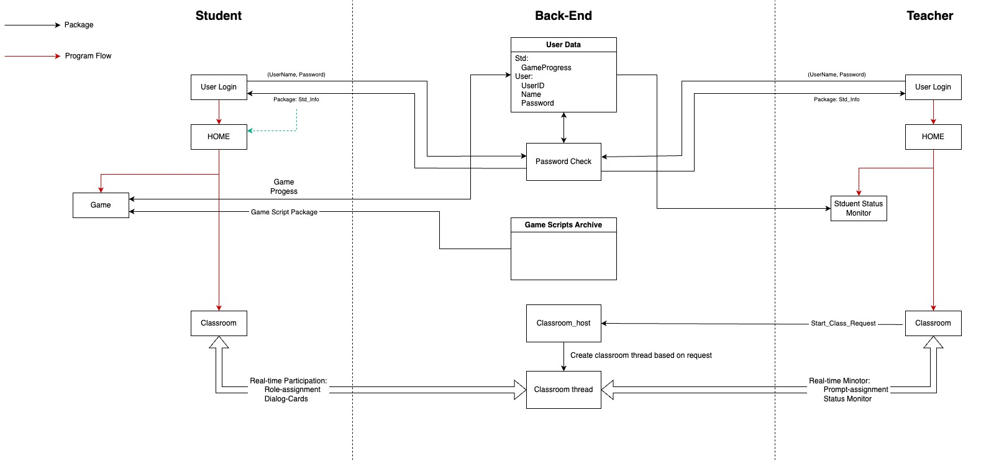

# Implementation Note:

## Front-end:

Front-end part of our project. We chose to use Flutter due to its advantages in cross-platform development.

The coding workspace for front-end development is under **"front_end"** folder. 

**To get started, you can:**

  1. Clone this entire repository to your device using [GitHub Desktop](https://github.com/apps/desktop).
  2. Open your IDE and choose "_Development/front_end/flutter_project_" as your project directory and _open project_.
  3. Your IDE will ~~hopefully~~ automatically know that GitHub is managing version control of this folder so you don't have to setup version control manually.

### About Flutter:

[Flutter](https://flutter.dev/) is the cross-platform development tool that we're using. Flutter itself is just an open-source [**SDK**](https://www.adjust.com/glossary/sdk/) developed by Google. To write your code, you will need an [**IDE**](https://www.codecademy.com/article/what-is-an-ide) like [_VSCode_](https://code.visualstudio.com/) or [_IntelliJ_](https://www.jetbrains.com/idea/). 

How do you develop with Flutter in IDE that is not designed for it? Well, check out the following links. You'll get an answer while you install Flutter.

BTW: The language Flutter uses is called **Dart**. 

[Install Flutter for MacOs](https://docs.flutter.dev/get-started/install/macos/desktop)

[Install Flutter for Windows](https://docs.flutter.dev/get-started/install/windows/desktop)

[How to write your first Flutter app](https://docs.flutter.dev/get-started/codelab)

:point_up_2: Please find an introduction to the features of Flutter here. It has basically everything you'll need: UI & More

## Back-end:

### Server Kernel:

- **What is it?**

  The server kernel is a robust, well-debugged layer of the program that manages the service layer and directly interacts with OS and files.
  We will have to make sure that the kernel layer **NEVER** crashes. 
  
- **What problem does it solve?**
  
  1. The server itself may crash because of unhandled exceptions, which requires manual recovery.
  2. We want to protect files and data.
  3. We want a shell interface to do administrative operations on files/server config., etc.
 
## Resources:

### Backend Field Map

[后端综述](https://www.bilibili.com/video/BV1hH4y1n7b4/?spm_id_from=333.337.search-card.all.click&vd_source=db70fd9c2492e86c888fbc7a5f78f6ca)

### About Flutter and UI

[Flutter可爱小熊！](https://www.bilibili.com/video/BV1Z6yuYkELt/?share_source=copy_web&vd_source=b56a8a69dd38510aa3ad0e132fa22597)

[Flutter x Dart教学](https://www.bilibili.com/video/BV1S4411E7LY/?share_source=copy_web&vd_source=b56a8a69dd38510aa3ad0e132fa22597)

[Flutter实战](https://www.bilibili.com/video/BV1Qb421Y7SV/?p=4&share_source=copy_web&vd_source=b56a8a69dd38510aa3ad0e132fa22597)

### About Frontend-Backend Communication

[前后端接口规范](https://github.com/f2e-journey/treasure/blob/master/api.md)

[前后端通讯：前端调用后端接口的五种方式，优劣势和场景](https://blog.csdn.net/m0_57344393/article/details/136084795)

[Geeks for Geeks: How to Connect Front End and Backend](https://www.geeksforgeeks.org/how-to-connect-front-end-and-backend/)

