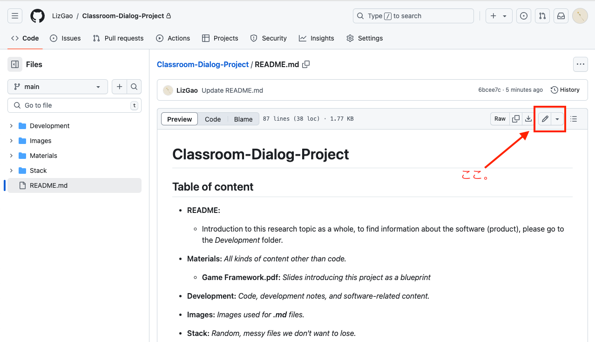
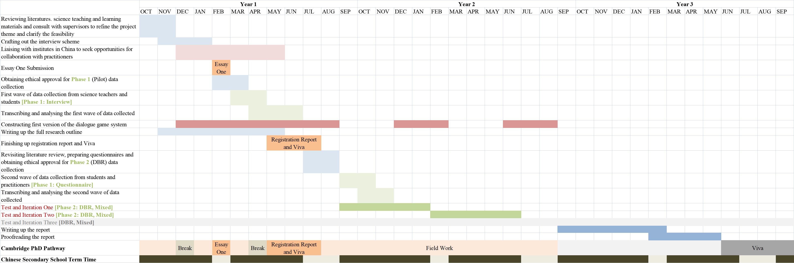

# Classroom-Dialogue-Project

> [!NOTE]
> 这是最外层的README file，需要大家一起完成，特别是Nunu。在这里我们要介绍整个项目以及每个文件夹的内容，以防迷路。
> 
> 我目前写了一个非常粗略的框架，放了一些副标题。Feel free to change anything you want when it makes sense.
> 
> 晚一点我会把中文关于如何编辑.md文件的部分存进另外一个文件里，这部分temporarily放在最前面。

> [!IMPORTANT]
> 大家有时间在最下面Team Members的部分把自己的自我介绍浅浅写一下。

## 第一次用GitHub的朋友，什么是README？

你现在读到的东西就是README，README的内容会自动出现在文件夹的下面，通常作为你想对刚点进这个文件夹的人说的话，可以写你想写的一切，介绍、打招呼、或者你想让看的人快滚出去 :cursing_face: 也不是不可以？？

## 第一次用GitHub的朋友，怎么编辑README.md？

* 点击README.md
* 点这个
   
* [如何编辑.md格式的文件？](https://docs.github.com/en/get-started/writing-on-github/getting-started-with-writing-and-formatting-on-github/basic-writing-and-formatting-syntax)
  总而言之，README的内容不像word文件一样可以直接编辑，而是要通过编辑.md文件来改变README的内容。GitHub网页会根据.md文件的内容渲染显示在首页的README。
* When you are editing: 可以点Preview实时查看渲染结果。
* When you are done editing: 在Preview中确认无误后，看到右上角点绿色 **"Commit changes..."** 了么？点它。下面的二选一选项不用管。如果你想要记录一下这一次编辑你修改了什么，做了什么，就在框框里写一下。如果不手动写也没关系，GitHub会根据你编辑的文件自动生成一个默认的commit message。
* After commit: 恭喜你，刚刚你修改的内容已经被保存下来了 :japanese_ogre:

## Table of content

* **README:**
  - Introduction to this research topic as a whole, to find information about the software (product), please go to the _Development_ folder.
    
* **Materials:** _All kinds of content other than code._
  - **Game Framework.pdf:** _Slides introducing this project as a blueprint_
 
* **Development:** _Code, development notes, and software-related content._

* **Images:** _Images used for **.md** files._

* **Stack:** _Random, messy files we don't want to lose._

## Introduction:

* **Background:**
  
  This project is the design product of Qingyi's PhD research project on classroom dialogue and science subjects in secondary education. Her research uses design-based research (DBR) method. She expects the product will undergo two to three iterations according to her collaboration with first-line school teachers. The product aims to facilitate student-student and student-teacher **classroom dialogue**, as well as students' **intrinsic motivation** to engage with the learning materials. Her research aims focus on (i) finding supports and challenges taht science teachers in China face when trying to conduct high-quality classroom dialogue; (ii) investigating the design components in which secondary school students find intrinsically motivating for them to engage further in learning and classroom dialogues. She may also look at (iii) whether neurodiverse students benefit more from the design product.

* **Classroom Dialoge:**

* **Intrinsic Motivation in Learning:**

## Scale:
   产品用户：高一/高二，中国物化生心课程，教师+学生
	
   产品模式：手机应用【教师端+学生端+admin端】
	
   项目时长：24.9~25.9 基于采访设计软件框架 25.9后给予反馈迭代两次
	
   使用场景：
	
      课前（教师备课/学生预习）
		
      课中（教师发牌+task/学生看牌+task）
		
      课后（教师上传录音/学生复习）
		
   产品目的：促进学生dialogu engagement + motivation

## Design:

* **Introduction**

  Our serious game product will have two modes, including (1) **solving** fantasised teaching content-related **problems** by role-playing in a group setting and (2) **previewing** and **reviewing** the teaching contents by having dialogues with the characters through *independent* choice making and feedback receiving. We decided to use these two modes because we wanted to provide a platform which invites students, especially those who are quiet, into classroom dialogues, so that (a) they learn implicitly, through simulation, how to use dialogues to communicate science knowledge; (b) they can be intrinsically motivated to learn more sciences; (c) their multimodal interaction with other students, teachers and teaching materials may be observed effectively; (d) their cognitive processes may be visualised automatically to their teachers to guide lesson preparation. The teaching content-related aims are **to be determined** with first-line secondary school teachers.

* **Narrative (Story) Texts:**   
  - *Intrinsic Motivation - Self-Determination*
  - *Intrinsic Motivation - Malone*
  - *Adolescent Motivation*

* **Science Learning Tasks (Problems) Design:**
  - *Learning Material*
  - *Nature of Science Education*
  - *Classroom Dialogue Facilitators*

* **Science Dialogue Simulation (Characeter) Design:**
  - *Learning Material*
  - *Nature of Science Education*
  - *Classroom Dialogue Structures*

* **Dialogue Cards:**
  - *Learning Material*
  - *Nature of Science Education*
  - *Classroom Dialogue Structures*

## Timeline:

- Light Red: Liaising with science teachers
- Drak Red: Liaising with technological facilitator team (creating, developing and iterating the design product)
- Light Green: Pilot study data collection and analysis: work with science teachers
- Dark Green: Design product testing; DBR data collection and analysis: work with first-line science teachers and their classes
- Blue: Independent work (with University of Cambridge)

## Team Members:

* **Qingyi Zheng**: Research Director

    Cambridge University - PhD (Probationary) in Education
  
* **Jiawen Yao**:

    佳文自己写一下

* **Xinyi (Sindy) Zheng**: Product Manager

   Purdue University - BS IT System Design & Digital Criminology
 
* **Yihan Huang**: User Experience Designer

   Purdue University - MFA Interaction Design

* **Yixin Hu**:

    馨馨自己写一下

* **Yunyi Gao**: Software Developer
  
   Purdue University - BS Computer Science
  
     - _Algorithmic Foundations_  
     - _Machine Intelligence_  
